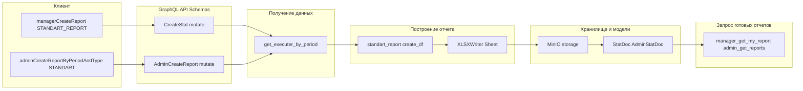
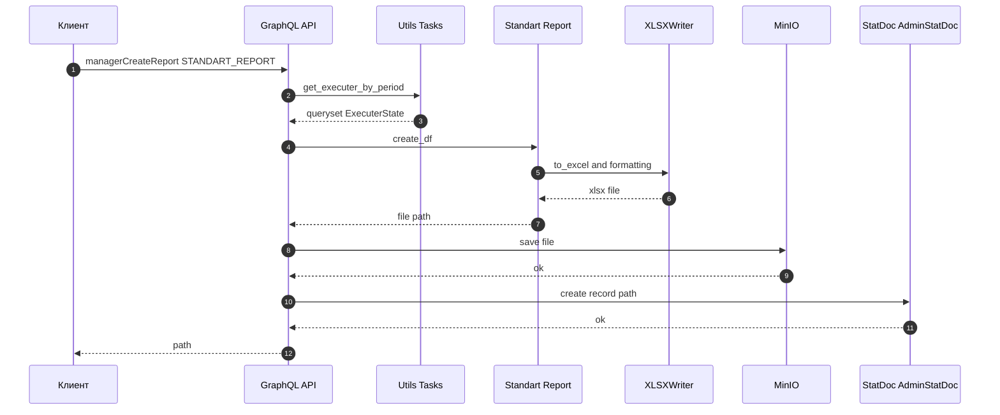
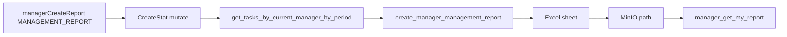
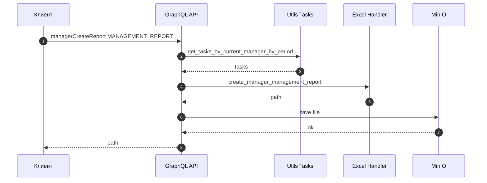

# Документация по отчетам (REPORTS_LIFECYCLE)

Документ описывает текущее устройство формирования отчетов в системе HOOPS Service. Включает ссылки на функции и модели, логику построения, карту полей, способы воспроизведения локально, а также диаграммы потоков данных.

Список отчетов:
- Стандартный отчет (для Менеджера и Администратора)
- Управленческий отчет (для Менеджера)

Ниже подробно разобраны оба отчёта: «Стандартный» и «Управленческий».

## Оглавление

- [Стандартный отчёт](#стандартный-отчет)
  - [Точки входа (GraphQL)](#точки-входа-graphql)
  - [Где и как формируется файл](#где-и-как-формируется-файл)
  - [Источники данных](#источники-данных)
  - [Логика построения (pandas)](#логика-построения-pandas)
  - [Карта полей (Стандартный отчёт)](#карта-полей-стандартный-отчет)
  - [Куда сохраняется отчёт](#куда-сохраняется-отчет)
  - [Как воспроизвести локально](#как-воспроизвести-локально)
  - [Диаграмма потока данных (Стандартный отчёт)](#диаграмма-потока-данных-стандартный-отчет)
  - [Ссылки на функции и файлы](#ссылки-на-функции-и-файлы)
  - [Особенности и возможные доработки](#особенности-и-возможные-доработки)

- [Управленческий отчёт](#управленческий-отчет)
  - [Назначение и аудитория](#назначение-и-аудитория)
  - [Точки входа (GraphQL)](#точки-входа-graphql-1)
  - [Источники данных](#источники-данных-1)
  - [Построитель и шаблон](#построитель-и-шаблон)
  - [Расширенная карта полей (основная таблица)](#расширенная-карта-полей-основная-таблица)
  - [Итоги по основной таблице](#итоги-по-основной-таблице)
  - [Детализация фактически оказанных услуг (по профессиям)](#детализация-фактически-оказанных-услуг-по-профессиям)
  - [Сортировка, фильтры и группировка](#сортировка-фильтры-и-группировка)
  - [Таймзона и формат отображения](#таймзона-и-формат-отображения)
  - [Пути и хранилище](#пути-и-хранилище)
  - [Запрос готовых отчётов](#запрос-готовых-отчётов)
  - [Валидации и ошибки](#валидации-и-ошибки)
  - [Как воспроизвести и проверить](#как-воспроизвести-и-проверить)
  - [Диаграммы (упрощённые)](#диаграммы-упрощённые)
  - [Ссылки на функции и файлы](#ссылки-на-функции-и-файлы-1)
  - [Справочник вычисляемых свойств и формул (ссылки на код)](#справочник-вычисляемых-свойств-и-формул-ссылки-на-код)
  - [Места потенциальных изменений при переработке отчётов](#места-потенциальных-изменений-при-переработке-отчётов)

---

---

## Стандартный отчет

### Назначение
Позволяет получить детализированный отчет по заявкам за период с разбивкой по исполнителям, времени/объему работ, выплатам, доле HOOPS и вознаграждению сервиса. Формируется в формате Excel.

### Точки входа (GraphQL)
- Мутация Менеджера: [`core/hotels/schemas/stat_doc/mutation.py`](core/hotels/schemas/stat_doc/mutation.py)
  - Класс: `CreateStat`
  - Ветка для типа: `STANDART_REPORT`
  - Сигнатура: `manager_create_report(input: InputForStatisticDoc!): CreateStat`
- Мутация Администратора: [`core/hotels/schemas/stat_doc/mutation.py`](core/hotels/schemas/stat_doc/mutation.py)
  - Класс: `AdminCreateReport`
  - Ветка для типа: `AdminStatDoc.TypeAdminReport.STANDART`

Описание типов:
- Перечисление типов отчетов Менеджера: [`core/hotels/schemas/enums.py`](core/hotels/schemas/enums.py) → `TypeReportDoc`
  - Значение: `STANDART_REPORT` (описание: «Стандартный отчет»)
- Типы входов:
  - [`core/hotels/schemas/stat_doc/input.py`](core/hotels/schemas/stat_doc/input.py) → `InputForStatisticDoc`
  - [`core/hotels/schemas/stat_doc/input.py`](core/hotels/schemas/stat_doc/input.py) → `InputForAdminCreateReport`
- Типы результатов (списки отчетов): [`core/hotels/schemas/stat_doc/type.py`](core/hotels/schemas/stat_doc/type.py)
  - `ReportDocType` (для Менеджера)
  - `AdminReportDocType` (для Администратора)

Примеры запросов в общей схеме: [`schema_graphql.md`](schema_graphql.md)

### Где и как формируется файл

Основная реализация (актуальная) для «Стандартного отчета» выполнена на pandas/xlsxwriter:
- Файл: [`core/hotels/scripts/reports/standart_report.py`](core/hotels/scripts/reports/standart_report.py)
  - Функция: `create_df(queryset, path, period, hotel_name, remuneration=10)`
  - Итог: создается Excel-файл с листом «Стандартный отчет», заголовками, суммами и футером.

Вызовы:
- Менеджер: [core/hotels/schemas/stat_doc/mutation.py](core/hotels/schemas/stat_doc/mutation.py) → `CreateStat.mutate()`
  - При `input.type == "STANDART_REPORT"` вызывается `create_df(tasks, path=builder.path_storage, period=..., hotel_name=...)`
- Администратор: [core/hotels/schemas/stat_doc/mutation.py](core/hotels/schemas/stat_doc/mutation.py) → `AdminCreateReport.mutate()` при типе `AdminStatDoc.TypeAdminReport.STANDART` — аналогичный вызов `create_df(...)`.

Альтернативная (историческая) реализация через шаблон Excel (openpyxl):
- Файл: [core/hotels/scripts/excel_handler.py](core/hotels/scripts/excel_handler.py)
  - Класс: `ReportBuilder`
  - Метод: `create_manager_standart_report(...)`
  - Сейчас для менеджерского «Стандартного» в коде используется pandas-вариант; openpyxl-вариант остается для совместимости/других типов.

### Источники данных

Получение задач/исполнителей за период:
- У Менеджера (для STANDART_REPORT):
  - `get_executer_by_period(start_date, end_date, manager)` — импорт из [core/hotels/utils/tasks.py](core/hotels/utils/tasks.py) (см. импорты в [core/hotels/schemas/stat_doc/mutation.py](core/hotels/schemas/stat_doc/mutation.py)). Возвращает выборку на основе состояний исполнителей в задачах.
- У Администратора (для STANDART):
  - Аналогично, но с фильтром по `hotel_id` (см. `AdminCreateReport.mutate`).

Модели и ключевые поля/свойства:
- [core/hotels/models.py](core/hotels/models.py)
  - `Profession.percent` — процент HOOPS.
  - `Task.rent` — ставка.
  - Связанные поля для `ExecuterState` (исполнители по заявкам), включая реальные/теоретические времена старта/остановки и комментарии/коррекции.

### Логика построения (pandas)

Функция: [`standart_report.create_df`](core/hotels/scripts/reports/standart_report.py)
- Аннотации ORM:
  - `executer_full_name = Concat(executer__middle_name, " ", executer__first_name, " ", executer__second_name)`
  - `profession_name = Coalesce(task__personal_profession__name, task__profession__name)`
  - Расчет времени:
    - `start_teor = Coalesce(start_at, task__start_at)`
    - `stop_task = task__start_at + INTERVAL task__duration HOUR` (через кастомный `Func`)
    - `stop_teor = Coalesce(stop_at, stop_task)`
    - `duration_f = stop_at - start_at` (факт)
    - `duration_t = stop_teor - start_teor` (теория)
  - Объемы (часы):
    - `volume_time_f = ceil((duration_f / 3600000000) * 100) / 100`
    - `volume_time_t = duration_t / 3600000000`
    - `volume_f = Coalesce(volume_of_the_work, volume_time_f)`
    - `volume_t = Coalesce(volume_of_the_work, volume_time_t)`
  - Стоимости:
    - `salary_f = volume_f * task__rent`
    - `salary_t = volume_t * task__rent`
  - Доля HOOPS:
    - `full_hoops_f = salary_f * task__profession__percent / 100`
    - `full_hoops_t = salary_t * task__profession__percent / 100`
  - Вознаграждение сервиса (remuneration, по умолчанию 10% от доли HOOPS):
    - `remuneration_of_the_service_f = full_hoops_f / 100 * remuneration`
    - `remuneration_of_the_service_t = full_hoops_t / 100 * remuneration`
  - Стоимость услуг сервиса:
    - `cost_of_the_service_f = full_hoops_f - remuneration_of_the_service_t` (обратить внимание: в коде используется `_t` — потенциальная неточность)
    - `cost_of_the_service_t = full_hoops_t - remuneration_of_the_service_t`
  - Выплата исполнителю:
    - `salary_executer_f = salary_f - full_hoops_f`
    - `salary_executer_t = salary_t - full_hoops_t`
  - Проблемы/статусы (Case/When):
    - Если `task__is_approved = False` → «Не согласована»
    - Если `start_at is null` → «Не было старта работы»
    - Если `stop_at is null` → «Не было старта работы» (вероятно, подразумевается «стопа»)
    - Итоговое поле `problem` = `correction_comment` (если есть `volume_of_the_work`), иначе первая из проблем/комментариев
  - Менеджер, дополнительные поля:
    - `manager_full_name` — конкатенация ФИО
    - `additional_date`, `additional_description` — из `task.additional`

- DataFrame формируется из `.values(...)`, затем колонки переименовываются на человекочитаемые на русском (см. «Карта полей» ниже), добавляются "московские" дата/время, считаются суммарные показатели.
- Запись в Excel через `xlsxwriter`: лист «Стандартный отчет», шапка (период, гостиница), автофильтр, границы, рублевое форматирование, итоговые строки, футер и печать/подпись.

### Карта полей (Стандартный отчет)

Финальные колонки листа «Стандартный отчет» (в порядке вывода):
1. ФИО Исполнителя ← `executer_full_name`
2. Наименование профессии ← `profession_name` (приоритет: персональная → базовая)
3. Наименование услуги ← `task__profession__description`
4. Дата ← `task__start_at` (в локали Europe/Moscow, формат `dd.MM.yyyy`)
5. Ставка, руб. ← `task__rent`
6. Время начала ← вычислено из `start_teor` (локаль, формат `HH:mm`)
7. Время окончания ← вычислено из `stop_teor` (локаль, формат `HH:mm`)
8. Объем услуг ← `volume_t` (теоретический объем/часы)
9. Итого оплат, руб. ← `salary_t`
10. Стоимость услуг HOOPS Service ← `cost_of_the_service_t`
11. Вознаграждение за исполнение поручения ← `remuneration_of_the_service_t`
12. Выплата исполнителям ← `salary_executer_t`
13. Номер заявки ← `task__id`
14. Статус заявки ← `problem` (см. логику Case/When выше)
15. Менеджер Заказчика ← `manager_full_name`
16. Дата комментария ← `additional_date` (если нет ни одной даты — колонка удаляется)
17. Комментарий ← `additional_description` (если нет данных — колонка удаляется)

 Итоговые строки внизу:
 - «Сумма услуг по заявкам за период» — объем/суммы по теоретическим данным
 - «Сумма фактически оказанных услуг за период» — объем/суммы по фактическим данным

#### Расширенная карта полей: ORM-выражения и edge cases

- __ФИО Исполнителя__
  - ORM: `executer_full_name = Concat("executer__middle_name", Value(" "), "executer__first_name", Value(" "), "executer__second_name")`
  - Edge cases: если часть ФИО `NULL`, конкатенация даст лишние пробелы — сейчас это допустимо и не чистится.

- __Наименование профессии__
  - ORM: `profession_name = Coalesce("task__personal_profession__name", "task__profession__name")`
  - Edge cases: если обе `NULL`, колонка будет пустой.

- __Наименование услуги__
  - ORM: `description = F("task__profession__description")`
  - Edge cases: если для персональной профессии есть отдельное описание, сейчас оно не приоритетится — берется из базовой `profession`.

- __Дата__
  - Источник: `task__start_at` → в DataFrame преобразуется через `start_teor.tz_convert('Europe/Moscow').strftime('%d.%m.%Y')`
  - Edge cases: отсутствие таймзоны у исходного `DateTimeField` приведет к ошибке `tz_convert` — в проде поля timezone-aware.

- __Ставка, руб.__
  - ORM: `task__rent`
  - Форматирование: `#,##0.00₽` в xlsxwriter.

- __Время начала__
  - ORM: `start_teor = Coalesce("start_at", "task__start_at")`
  - Post: `start_teor.tz_convert('Europe/Moscow').strftime('%H:%M')`
  - Edge cases: если оба `NULL` — колонка будет пустой строкой.

- __Время окончания__
  - ORM: `MinuteInterval(Func)` с шаблоном `INTERVAL %(expressions)s HOUR`; `_end_date = F("task__start_at") + MinuteInterval(F("task__duration"))`
  - `stop_task = ExpressionWrapper(_end_date, output_field=DateTimeField())`
  - `stop_teor = Coalesce("stop_at", "stop_task")`
  - Post: `stop_teor.tz_convert('Europe/Moscow').strftime('%H:%M')`
  - Edge cases: если `task__duration` `NULL`, `stop_task` не вычислится — тогда используется `stop_at` или пусто.

- __Объем услуг__ (теория)
  - ORM: `duration_t = ExpressionWrapper(F("stop_teor") - F("start_teor"), output_field=FloatField())`
  - `volume_time_t = ExpressionWrapper(F("duration_t") / 3600000000, output_field=FloatField())`
  - `volume_t = Coalesce("volume_of_the_work", "volume_time_t")`
  - Edge cases: если `volume_of_the_work` задан вручную — заменяет расчетные часы; возможны нецелые значения.

- __Итого оплат, руб.__ (теория)
  - ORM: `salary_t = F("volume_t") * F("task__rent")`

- __Стоимость услуг HOOPS Service__ (теория)
  - ORM: `full_hoops_t = F("salary_t") * F("task__profession__percent") / 100`
  - `remuneration_of_the_service_t = F("full_hoops_t") / 100 * remuneration`
  - `cost_of_the_service_t = F("full_hoops_t") - F("remuneration_of_the_service_t")`
  - Edge cases: `remuneration` задается параметром функции (по умолчанию 10) — сейчас не конфигурируется из БД.

- __Вознаграждение за исполнение поручения__ (теория)
  - ORM: `remuneration_of_the_service_t` (см. выше)

- __Выплата исполнителям__ (теория)
  - ORM: `salary_executer_t = F("salary_t") - F("full_hoops_t")`

- __Номер заявки__
  - Источник: `task__id`

- __Статус заявки__
  - ORM:
    - `problem1 = Case(When(task__is_approved=False, then=Value("Не согласована")), default=None)`
    - `problem2 = Case(When(start_at__isnull=True, then=Value("Не было старта работы")), default=None)`
    - `problem3 = Case(When(stop_at__isnull=True, then=Value("Не было старта работы")), default=None)`
    - `problem_res = Coalesce("problem1", "problem2", "problem3", "correction_comment")`
    - `problem = Case(When(volume_of_the_work__isnull=False, then=F("correction_comment")), default=F("problem_res"))`
  - Edge cases: текст «Не было старта работы» используется и для отсутствия стопа — вероятно, опечатка; для стопа логичнее «Не было стопа работы».

- __Менеджер Заказчика__
  - ORM: `manager_full_name = Concat("task__manager__first_name", Value(" "), "task__manager__middle_name", Value(" "), "task__manager__second_name")`

- __Дата комментария__ / __Комментарий__
  - ORM: `additional_date = Case(When(task__additional__isnull=False, then=F("task__additional__datetime")), default=None)`
  - `additional_description = Case(When(task__additional__isnull=False, then=F("task__additional__description")), default=None)`
  - Post: если по всей выборке нет ни одной даты — обе колонки удаляются из финального Excel.

- __Факт-метрики (для итоговых строк)__
  - ORM:
    - `duration_f = ExpressionWrapper(F("stop_at") - F("start_at"), output_field=FloatField())`
    - `volume_time_f = Ceil((F("duration_f") * 100) / 3600000000) / 100`
    - `volume_f = Coalesce("volume_of_the_work", "volume_time_f")`
    - `salary_f = F("volume_f") * F("task__rent")`
    - `full_hoops_f = F("salary_f") * F("task__profession__percent") / 100`
    - `remuneration_of_the_service_f = F("full_hoops_f") / 100 * remuneration`
    - `cost_of_the_service_f = F("full_hoops_f") - F("remuneration_of_the_service_t")  # потенциальная ошибка: ожидается _f`
    - `salary_executer_f = F("salary_f") - F("full_hoops_f")`
  - Aggregation (в pandas): суммы по соответствующим колонкам с `round(..., 2)`.
  - Edge cases:
    - Округление `volume_time_f` на уровне ORM: `ceil(... * 100) / 100` — всегда вверх до сотых, что может завышать объем.
    - Возможная логическая ошибка с `cost_of_the_service_f` (вычитание `_t`).
    - Если `stop_at` отсутствует, `duration_f` будет `NULL` → `volume_time_f` также `NULL`, что может привести к пустым фактическим суммам.

### Куда сохраняется отчет

- Путь генерируется в мутациях и хранится в моделях документов:
  - Менеджер: `StatDoc` — [`core/hotels/models.py`](core/hotels/models.py)
  - Администратор: `AdminStatDoc` — [`core/hotels/models.py`](core/hotels/models.py)
- Файлы сохраняются в MinIO:
  - Префикс хранилища: `/usr/local/share/minio/{bucket}` (см. [`core/hotels/config.py`](core/hotels/config.py) и использование в [`core/hotels/scripts/excel_handler.py`](core/hotels/scripts/excel_handler.py) `ReportBuilder`)
  - Шаблон пути: например, `statistic/{manager.pk}/{uuid}/{type}.xlsx`

### Как воспроизвести локально

Предусловия:
- Авторизация обязательна (нужен токен менеджера/администратора)
- В заголовках запроса желательно передать `time-zone-offset` (в минутах; по умолчанию `-180`)
- В базе должны быть задачи/исполнители в выбранном периоде

Пример GraphQL-мутации (Менеджер → Стандартный отчет):

```graphql
mutation ManagerCreateStandardReport($input: InputForStatisticDoc!) {
  managerCreateReport(input: $input) {
    path
  }
}
```

Пример переменных:

```json
{
  "input": {
    "startDate": "2025-08-01T00:00:00Z",
    "endDate": "2025-08-31T23:59:59Z",
    "type": "STANDART_REPORT"
  }
}
```

Заголовки запроса:
- `Authorization: Bearer <token>`
- `time-zone-offset: -180` (пример)

Результат:
- Возвращается поле `path` — относительный путь в MinIO. Ссылка/скачивание реализуется на стороне сервера/клиента, в коде доступ к пути организован через класс `ReportBuilder` из [`core/hotels/scripts/excel_handler.py`](core/hotels/scripts/excel_handler.py).

Пример GraphQL-мутации (Администратор → Стандартный отчет):

```graphql
mutation AdminCreateStandardReport($input: InputForAdminCreateReport!) {
  adminCreateReportByPeriodAndType(input: $input) {
    path
  }
}
```

Пример переменных:

```json
{
  "input": {
    "startDate": "2025-08-01T00:00:00Z",
    "endDate": "2025-08-31T23:59:59Z",
    "type": "STANDART",
    "hotelId": "<ID гостиницы>"
  }
}
```

### Диаграмма потока данных (Стандартный отчет)



Дополнительно — последовательность вызовов:



### Ссылки на функции и файлы

- Входные точки:
  - [`core/hotels/schemas/stat_doc/mutation.py`](core/hotels/schemas/stat_doc/mutation.py) → `CreateStat.mutate`, `AdminCreateReport.mutate`
  - [`core/hotels/schemas/stat_doc/query.py`](core/hotels/schemas/stat_doc/query.py) → `manager_get_my_report`, `admin_get_reports`
- Типы/входы:
  - [`core/hotels/schemas/enums.py`](core/hotels/schemas/enums.py) → `TypeReportDoc`
  - [`core/hotels/schemas/stat_doc/input.py`](core/hotels/schemas/stat_doc/input.py) → `InputForStatisticDoc`, `InputForAdminCreateReport`
  - [`core/hotels/schemas/stat_doc/type.py`](core/hotels/schemas/stat_doc/type.py)
- Построение отчета:
  - [`core/hotels/scripts/reports/standart_report.py`](core/hotels/scripts/reports/standart_report.py) → `create_df`
  - Альтернатива (openpyxl): [`core/hotels/scripts/excel_handler.py`](core/hotels/scripts/excel_handler.py) → `ReportBuilder.create_manager_standart_report`
- Хранилище/пути:
  - [`core/hotels/scripts/excel_handler.py`](core/hotels/scripts/excel_handler.py) → класс `ReportBuilder` (путь `path_storage`)
  - [`core/hotels/scripts/reports/utils.py`](core/hotels/scripts/reports/utils.py) → футер/печать/подпись
- Модели:
  - [`core/hotels/models.py`](core/hotels/models.py) → `StatDoc`, `AdminStatDoc`, `Task`, `Profession.percent` и др.

### Особенности и возможные доработки

- Параметр `remuneration` в `create_df` по умолчанию равен 10. Имеет смысл:
  - Либо прокидывать его из входных параметров GraphQL
  - Либо брать из глобальных настроек (например, аналог `settings.models.get_remuneration()`)
- В `cost_of_the_service_f` используется вычитание `remuneration_of_the_service_t` — вероятно, ожидается `_f`. Нужна проверка постановки задачи.
- Колонки «Дата комментария» и «Комментарий» удаляются, если по всем строкам пусто — это нормализует ширину таблицы, но может путать, если ожидаем всегда видеть эти поля.
---

## Управленческий отчет

### Назначение и аудитория

Управленческий отчет предназначен для оперативного контроля оказанных услуг за период на уровне гостиницы и менеджеров:
- Показывает поминутно/почасово факт оказания услуг по каждой заявке и исполнителю.
- Делит стоимость услуги на долю HOOPS и выплату Исполнителю, с расчётом с/без НДС.
- Даёт агрегаты по периоду и детализацию по профессиям, позволяя сравнивать план/факт.
- Целевая аудитория: операционные менеджеры гостиницы, координаторы HOOPS, финансовая служба (для сверок).

### Точки входа (GraphQL)

- Мутация менеджера: [core/hotels/schemas/stat_doc/mutation.py](core/hotels/schemas/stat_doc/mutation.py) → `CreateStat.mutate`
  - Вход `TypeReportDoc.MANAGEMENT_REPORT`
  - Путь к результату записывается в модель `StatDoc` ([core/hotels/models.py](core/hotels/models.py))

Пример запроса:

```graphql
mutation ManagerCreateManagementReport($input: InputForStatisticDoc!) {
  managerCreateReport(input: $input) { path }
}
```

```json
{
  "input": {
    "startDate": "2025-08-01T00:00:00Z",
    "endDate": "2025-08-31T23:59:59Z",
    "type": "MANAGEMENT_REPORT"
  }
}
```

### Источники данных

- Фильтрация заявок: [core/hotels/utils/tasks.py](core/hotels/utils/tasks.py) → `get_tasks_by_current_manager_by_period(manager, start, end)`
- Для строк отчёта используются `task` и связанные `executer` (пропускаются статусы исполнителя `CANCEL_BY_CUSTOMER`, `CANCEL_YOURSELF`).

### Построитель и шаблон

- Класс: [core/hotels/scripts/excel_handler.py](core/hotels/scripts/excel_handler.py) → `ReportBuilder`
- Метод: `create_manager_management_report(tasks, period)`
- Лист Excel: «Управленческий отчёт» (используется шаблон `MANAGEMENT_REPORT.xlsx`)

### Расширенная карта полей (основная таблица)

Для каждой пары Заявка × Исполнитель заполняются колонки:

- A: ФИО исполнителя
  - Источник: `executer.executer.full_name`
  - Тип/формат: текст
  - Примечание: пропускаются исполнители со статусами `CANCEL_BY_CUSTOMER`, `CANCEL_YOURSELF` (строка не создаётся)
- B: Наименование услуги
  - Источник: `task.finish_name`
  - Тип/формат: текст
- C: Дата заявки (локально)
  - Источник: `get_time_with_offset(task.start_at).date()`
  - Тип/формат: дата `DD.MM.YYYY`
- D: Ставка с НДС
  - Источник: `task.rent`
  - Тип/формат: число `#,##0.00₽`
- E: Время старта (локально)
  - Источник: `get_time_with_offset(executer.start_at_real_or_task).time()`
  - Тип/формат: время `HH:MM`
  - Примечание: берётся фактическое время, если есть; иначе — из задачи
- F: Время стопа (локально)
  - Источник: `get_time_with_offset(executer.stop_at_real_or_task).time()`
  - Тип/формат: время `HH:MM`
- G: Объём услуг (часы)
  - Источник: `executer.get_work_time_in_hours`
  - Тип/формат: число `0.00`
  - Краевой случай: может быть 0 при отменах/ошибках времени
- H: Стоимость услуг (руб)
  - Формула: `=D{row}*G{row}` (см. `formulas["itog_once"]`)
  - Тип/формат: `#,##0.00₽`
- I: Стоимость HOOPS с НДС (руб)
  - Формула: `=H{row}*(100-multiplier)/100` (см. `formulas["for_hoops"]`), `multiplier = task.profession.multiplier`
  - Тип/формат: `#,##0.00₽`
  - Пояснение: если `multiplier=90`, то доля HOOPS = 10% от стоимости услуги
- J: Стоимость HOOPS без НДС (руб)
  - Формула: `=I{row}/1.2` (см. `formulas["cost_hoops_without_nds"]`)
  - Тип/формат: `#,##0.00₽`
- K: Стоимость Исполнителю (руб)
  - Формула: `=H{row}-I{row}` (см. `formulas["for_executers"]`)
  - Тип/формат: `#,##0.00₽`
- L: Номер заявки
  - Источник: `task.id`
  - Тип/формат: число/текст
- M: Проблема/Комментарий
  - Источник: `executer.problem`
  - Тип/формат: текст (может быть пусто)
- N: ФИО менеджера
  - Источник: `task.manager.fullname`
  - Тип/формат: текст

Агрегаты в процессе обхода строк:

- Сумма комиссий HOOPS по задачам → `summ_for_hoops += executer.get_sum_for_hoops`
- Факт по HOOPS и оплате исполнителей учитывается только если `executer.get_work_time_in_hours_real` задан:
  - `summ_for_hoops_real += executer.get_sum_for_hoops`
  - `for_executer_real += executer.get_sum_for_pay`
  - `summ_for_pay += executer.get_sum_full`

### Итоги по основной таблице

- Сумма часов (G) → `=SUM(G{first}:G{last})`
- Сумма оплаты (H) → `=SUM(H{first}:H{last})`
- Сумма комиссий HOOPS (I) → прямая сумма переменной `summ_for_hoops`
- Сумма комиссий HOOPS без НДС (J) → `summ_for_hoops / 1.2`
- Сумма выплат Исполнителям (K) → `=SUM(K{first}:K{last})`

Дополнительно используются формулы:
- `formulas["itog_all_hours_table"]` → диапазонная сумма часов в таблице.
- `formulas["itog_all_rub_table"]` → диапазонная сумма оплаты в рублях.
- `formulas["for_executers_table"]` → диапазонная сумма выплат Исполнителям.

Фактические суммы за период:

- Объём часов (факт) → `sum(task.full_work_time_real)`
- Сумма к оплате (факт) → `sum(task.full_pay_real)`
- HOOPS факт → `summ_for_hoops_real`
- HOOPS факт без НДС → `summ_for_hoops_real / 1.2`
- Выплаты Исполнителям факт → `for_executer_real`

### Детализация фактически оказанных услуг (по профессиям)

Секция появляется, если есть задачи с персональными профессиями (`tasks.exclude(personal_profession=None)`). Для каждой персональной профессии (и затем для оставшихся задач по ставке/профессии) формируются строки со столбцами:

- A: Наименование профессии
- B: Объём услуг (часы, факт) → `sum(x.full_work_time_real)` по группе
- C: Ставка с НДС → `rent`
- D: Ставка без НДС → `without_tax`
- E: Стоимость HOOPS с НДС → `for_hoops`
- F: Стоимость HOOPS без НДС → `for_hoops_without_tax`
- G: Стоимость Исполнитель → `rent - for_hoops`
- H: Стоимость услуг с НДС → формула `=C{row}*B{row}`
- I: Стоимость услуг без НДС → формула `=D{row}*B{row}`
- J: Сумма НДС → формула `=H{row}-I{row}`

Итоги по секции:

- Итог сумма с НДС (H) → `=SUM(H{first}:H{last})`
- Итог сумма без НДС (I) → `=SUM(I{first}:I{last})`
- Итог объём услуг (часы) → `=SUM(B{first}:B{last})`

Используемые формулы секции:
- `formulas["multiply_NDS"]` → `=C{row}*B{row}` (стоимость с НДС)
- `formulas["multiply_without_NDS"]` → `=D{row}*B{row}` (стоимость без НДС)
- `formulas["sum_nds"]` → `=H{row}-I{row}` (сумма НДС)
- Итоги секции: `formulas["itog_all_rub"]`, `formulas["itog_all_rub_NDS"]`, `formulas["itog_all_hours"]` для сумм по колонкам H, I, B соответственно.

### Сортировка, фильтры и группировка

- Сортировка строк основной таблицы: по `task.profession`, затем по `task.start_at` (см. `order_by("profession", "start_at")` в выборке).
- Исключаются заявки со статусом `DELETED`.
- Исключаются исполнители со статусами `CANCEL_BY_CUSTOMER`, `CANCEL_YOURSELF` (строки не создаются).
- Детализация по профессиям делится на две группы:
  - `tasks_with_personal_professions` (персональные профессии)
  - `tasks_without_personal_professions` (по ставкам и профессиям)

### Таймзона и формат отображения

- Смещение таймзоны берётся из HTTP-заголовка `time-zone-offset`, по умолчанию `-180` (МСК).
- Даты и время формируются через `ReportBuilder.get_time_with_offset(...)` (см. [core/hotels/scripts/excel_handler.py](core/hotels/scripts/excel_handler.py)) и форматируются как:
  - Дата: `DD.MM.YYYY`
  - Время: `HH:MM`
  - Числа: часы `0.0`/`0.00`, деньги `#,##0.00₽`

### Пути и хранилище

- Путь к файлу задаётся в `StatDoc.path` как `statistic/{manager.pk}/{uuid}/{type}.xlsx` (см. `CreateStat.mutate`).
- Файл сохраняется через `openpyxl` в `ReportBuilder.path_storage` (см. [core/hotels/scripts/excel_handler.py](core/hotels/scripts/excel_handler.py)), после чего доступен по URL, возвращаемому в ответе мутации.
  См. также [core/hotels/schemas/stat_doc/mutation.py](core/hotels/schemas/stat_doc/mutation.py) → `CreateStat.mutate`.

### Запрос готовых отчётов

- Запросы списка и получения путей реализованы в [core/hotels/schemas/stat_doc/query.py](core/hotels/schemas/stat_doc/query.py):
  - `manager_get_my_report`
  - `admin_get_reports`


### Валидации и ошибки

- При типе `MANAGEMENT_REPORT` выборка задач идёт через `get_tasks_by_current_manager_by_period`; при отсутствии задач GraphQL-уровень может вернуть ошибку assert в других типах, для данного типа — пустой отчёт возможен, но строки не формируются.
- Возможные расхождения по часам возникают при пустых фактических временных полях; в этом случае объём может равняться 0.

### Как воспроизвести и проверить

1) Вызвать мутацию `managerCreateReport` с типом `MANAGEMENT_REPORT` (см. пример выше).
2) Дождаться пути к файлу в ответе и скачать его через эндпоинт выдачи файлов.
3) Проверить:
   - Корректность сумм в H, I, J, K по нескольким строкам вручную.
   - Соответствие агрегатов «Сумма услуг за период» и «Сумма фактически оказанных услуг».
   - Детализацию по профессиям и конечные итоги секции.

Примечания:

- Часы и суммы для «факторной» части берутся по `*_real` полям.
- Ячейки форматируются как числа с фиксированными форматами (`0.0`, `#,##0.00₽`).

### Диаграммы (упрощённые)

Поток данных:



Последовательность:



### Ссылки на функции и файлы

- Построитель: [core/hotels/scripts/excel_handler.py](core/hotels/scripts/excel_handler.py) → `ReportBuilder.create_manager_management_report`
- Точки входа: [core/hotels/schemas/stat_doc/mutation.py](core/hotels/schemas/stat_doc/mutation.py) → `CreateStat.mutate`
- Enum типа отчёта: [core/hotels/schemas/enums.py](core/hotels/schemas/enums.py) → `TypeReportDoc.MANAGEMENT_REPORT`
- Источник задач: [core/hotels/utils/tasks.py](core/hotels/utils/tasks.py) → `get_tasks_by_current_manager_by_period`

### Справочник вычисляемых свойств и формул (ссылки на код)

- Модель `ExecuterState` ([core/hotels/models.py](core/hotels/models.py)):
  - `get_work_time_in_hours` — часы/объём услуг по исполнителю с учётом ручного `volume_of_the_work`.
  - `get_work_time_in_hours_real` — фактические часы (учитываются в «факт»-блоках агрегатов).
  - `get_sum_full` — полная стоимость услуги: `task.rent * (volume_of_the_work or get_work_time_in_hours)`.
  - `get_sum_for_pay` — выплата Исполнителю: `get_sum_full * (task.profession.multiplier / 100)`.
  - `get_sum_for_hoops` — доля HOOPS с НДС: `get_sum_full * (1 - (task.profession.multiplier / 100))`.
  - `get_sum_for_hoops_for_remuneration` — вознаграждение сервиса: `get_sum_for_hoops / 100 * settings.models.get_remuneration()`.
  - `get_sum_for_hoops_without_remuneration` — доля HOOPS без вознаграждения сервиса.
  - `problem` — текст статуса строки (несогласована, нет старта/стопа, комментарий корректировки).

- Модель `Profession` ([core/hotels/models.py](core/hotels/models.py)):
  - `percent` — процент HOOPS (например, 10 означает 10% от стоимости услуги).
  - `multiplier` — «множитель» для выплаты Исполнителю: `100 - percent` (например, при 10% — `multiplier=90`).
  - `calculate_rate(cost, calculate_cost_for_executer)` — вспомогательный пересчёт ставки «вперёд/назад» между суммой к выплате Исполнителю и суммой, оплачиваемой Гостиницей.

- Пояснения к НДС и remuneration:
  - В основной таблице «Стоимость HOOPS без НДС» получается делением доли HOOPS на 1.2 (`/ 1.2`).
  - Параметр `remuneration` в «Стандартном отчёте» задаётся аргументом функции (дефолт 10). В Управленческом отчёте вознаграждение сервиса берётся через `settings.models.get_remuneration()` в свойствах `ExecuterState`.
  - При переработке стоит унифицировать источник и способ передачи `remuneration` (см. список изменений ниже).

### Места потенциальных изменений при переработке отчётов

- Унификация источника `remuneration`:
  - В «Стандартном отчёте» — параметр функции `create_df(..., remuneration=10)`.
  - В «Управленческом» — `get_remuneration()` внутри `ExecuterState`.
  - Рекомендация: вынести в единый конфиг/настройку и/или прокидывать через GraphQL параметр, использовать одинаково в обоих отчётах.

- Явная фиксация НДС:
  - Сейчас деление на `1.2` жёстко зашито в формулы. Если ставка НДС изменится, следует вынести коэффициент НДС в глобальные настройки.

- Уточнение и выравнивание формул доли HOOPS:
  - Используются эквивалентные подходы: через `percent` (`salary * percent/100`) и через `multiplier` (`salary * (1 - multiplier/100)`).
  - Рекомендация: выбрать один способ и использовать его повсеместно для ясности.

- Проверка корректности «факт»-метрик:
  - В «Стандартном отчёте» есть потенциальная неточность: `cost_of_the_service_f` вычитает `remuneration_of_the_service_t` вместо `_f`.
  - Рекомендация: исправить и покрыть тестом агрегации факта.

- Отображение статусов проблем:
  - Текст для отсутствия стопа совпадает с текстом для старта в «Стандартном отчёте». Рекомендуется исправить формулировку.

- Параметризация и локализация форматов:
  - Таймзона берётся из заголовка; форматы дат/времени/валют сейчас фиксированы. Возможно вынести форматы в конфиг.

---

## Глоссарий и константы

- Термины:
  - «Доля HOOPS» — часть стоимости услуги, остающаяся сервису HOOPS. В Стандартном отчёте рассчитывается через `percent` профессии; в Управленческом — через `multiplier` (эквивалентные формы).
  - «Вознаграждение сервиса (remuneration)» — процент от доли HOOPS, направляемый на вознаграждение сервиса.
  - «Ставка с НДС/без НДС» — стоимость единицы услуги с/без налоговой составляющей.

- Константы и настройки:
  - НДС: в формулах используется коэффициент `1.2` для пересчёта «с НДС» → «без НДС». Рекомендуется вынести в настройки.
  - Remuneration:
    - Стандартный отчёт: параметр функции `create_df(..., remuneration=10)` в [core/hotels/scripts/reports/standart_report.py](core/hotels/scripts/reports/standart_report.py).
    - Управленческий отчёт: берётся из `settings.models.get_remuneration()` (используется в свойствах `ExecuterState`).
  - Таймзона: заголовок `time-zone-offset` (минуты; по умолчанию `-180`), применяется в [core/hotels/scripts/excel_handler.py](core/hotels/scripts/excel_handler.py) → `ReportBuilder.get_time_with_offset`.
